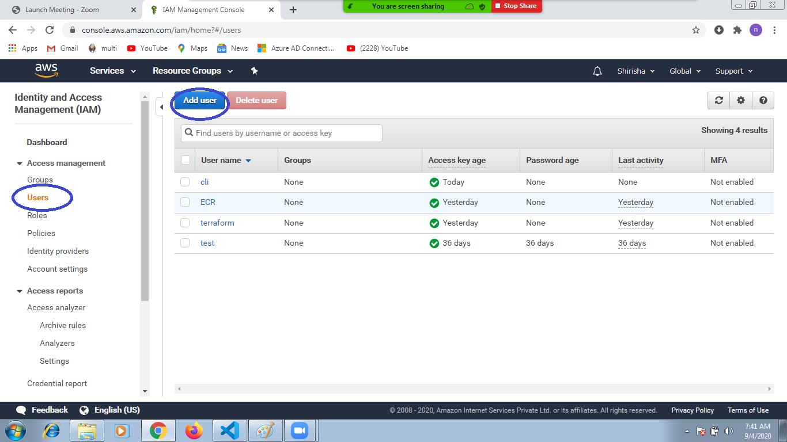
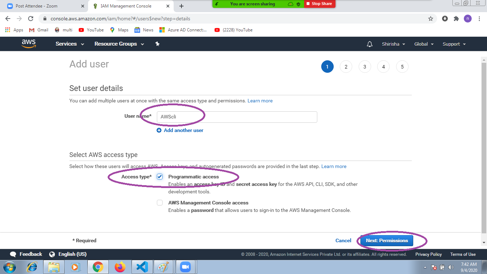
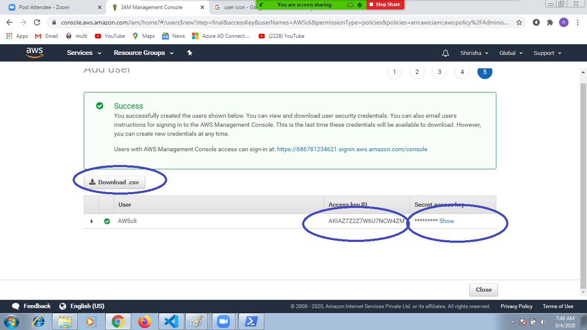

## setup:
   1. create IAM user 
      
      
      
      
   2. install aws cli (any platform) 
      1. install awscli in ubuntu
         ```
         sudo apt-get update
         sudo apt-get install awscli -y
         ``` 
      2. install aws cli in windows
         ```
         choco install awscli -y
         ```
   3. configure AWS 
      ```
      aws configure
      ```
      
## create ec2 machine using awscli  
### steps: 
        1. imageid ubuntu/windows
        2. network 
        3. storage
        4. security group
        5. keypair
        6. instance type (hardware) t2.micro
      ```
      aws ec2 run-instances --image-id ami-0a634ae95e11c6f91 --instance-type t2.micro --key-name awscli --count 1
      ```
[Reference](https://docs.aws.amazon.com/cli/latest/reference/ec2/)

## stop Ec2 machine using awscli  
   ```
   aws ec2 stop-instances --instance-ids i-04fe9203132f2f8d1
   ```
## start EC2 machine using aws cli
   ```
   aws ec2 start-instances --instance-ids i-04fe9203132f2f8d1
   ```
## terminate ec2 machine using awscli
   ```
   aws ec2 terminate-instances --instance-ids i-04fe9203132f2f8d1
   ```
### if remove aws iam user what happen
    it will not speak with AWS
## create Image using AWScli 
   ```
   aws ec2 create-image --instance-id i-1234567890abcdef0 --name "My server" --description "An AMI for my server"
   ````

