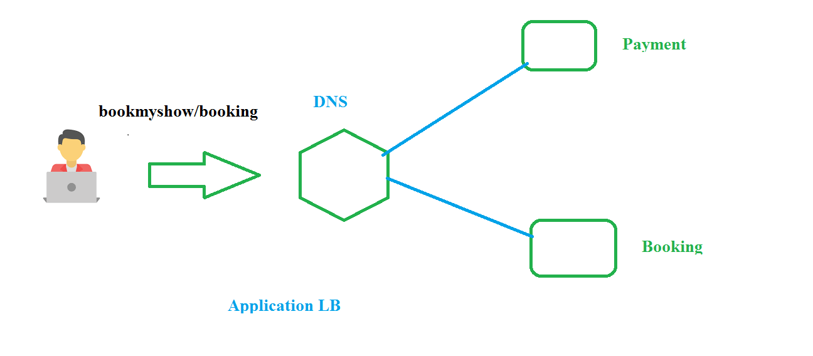

## ELB (Elastic Load Balancer) 
   1. network Load balancer 
      1. layer 4 in ISO (transport layer)
      2. TCP/Ip protocal and port numbers 
      3. it meant for monolothic 
   2. Application Load balancer
      1. layer 7 in ISO (application layer)
      2. http/https (routing)
      3. its meant Micro service application  
## Application Load balancers 

1. create ASG for Payment 
    1. create Image 
         1. launch ec2 machine and login into ec2 machine 
         2. install apache2 
            ```
            sudo apt-get update
            sudo apt-get install apache2 -y
            ``` 
         3. create file index.html and insert html content
            ```
            sudo -i
            cd /var/www/html
            mkdir Payment
            cd Payment 
            vi index.html 
            ---
            <h1>hello this is the payment page</h1>
            ---
            ``` 
         4. create image 
      2. Launch configuration
      3. ASG 
    2. create ASG for Booking 
      1. create Image 
         1. launch ec2 machine and login into ec2 machine 
         2. install apache2 
            ```
            sudo apt-get update
            sudo apt-get install apache2 -y
            ``` 
         3. create file index.html 
            ```
            sudo -i
            cd /var/www/html
            mkdir Booking
            cd Booking 
            vi index.html 
            ---
            <h1>hello this is the Booking Page page</h1>
            ---
            ``` 
         4. create image 
      2. Launch configuration
      3. ASG 
2. create Target group 
   1. Payment 
   2. Booking
3. add targets into ASG 
   1. goto ASG
   2. click on Edit
   3. select target group 
   4. update
4. create Application Load balancer 
5. listeners in add rule
   