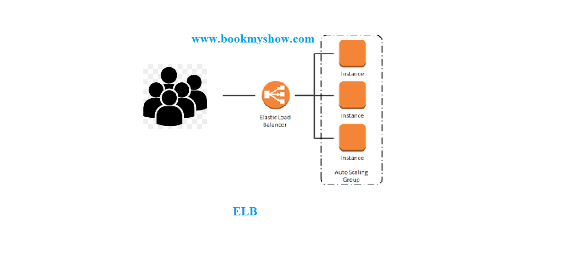

## Load Balancer 
   1. I have multiple Machines  in ASG 
   2. In future might be increase or decrease machines . 3. based on traffic.  we don’t know
   4. Now which IP Address I give to customers for access application(BookMyShow)?
   5. If I give all Machine IP’s in that case customers need to access www.bookmyshow1.com if it server busy access with www.bookmyshow2.com and so on …
   6. Is This Right Idea?  No
   7. Customer except one website like www.bookmyshow.com , www.flipkart.com  etc
   8. Solution is Load Balancer in aws we call ELB
   9. Load balancer create centralized DNS or IP 
   10. Load Balancer Centralized IP is take the request   from customer and share traffic between machine(ASG) 
   11. Load Balancer had a intelligence on Which Machine is healthy/Unhealthy 
   12. LB send request only healthy Machine 
   
## types of ELB
   1. Network ELB
   2. Application ELB

## LAB Setup 
   1. create ASG 
      1. create image (AMI)
      2.  create Launch configuration 
      3. create ASG 
         ```
          min = 2
          max = 10 
          policies 
            scale-out: cpu>= 75% add 1 machine
            scale-in:  cpu<= 30% remove 1machine  
         ```
   2. Load balancer 
      1. create Network Load balancer  
   3. add ELB in ASG 
      1. goto ASG 
      2. click on actions 
      3. click on edit
      4. add target group 
      5. save 
   4. open page with ELB DNS record 
      ```
      dns-record/info.php
      eg: http://lb-lamp-b44556ef03afa2c0.elb.us-east-1.amazonaws.com/info.php
      ```