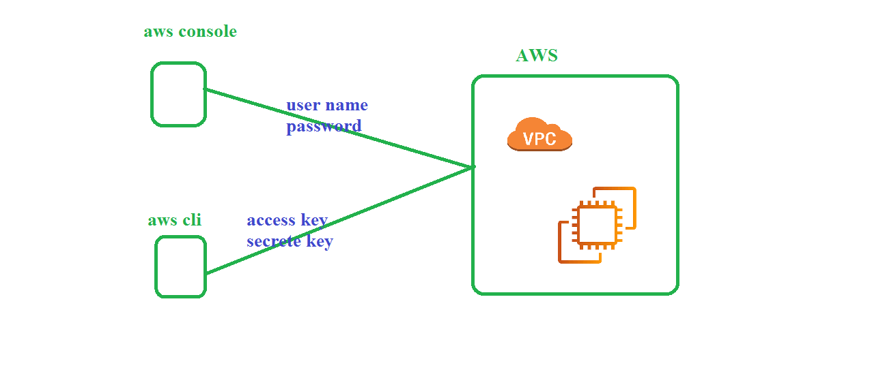

## pending 
  1. vpn
  2. direct connect
  3. security: 
      1. NACL
      2. security group
  4. transit gateway: vpc peering 
## AWS CLI 

   1. Lab setup 
      1. install awscli 
         ```
         choco install awscli -y
         sudo apt-get update && sudo apt-get install awscli -y
         ``` 
      2. create IAM user 
         1. goto service
         2. search for IAM
         3. create user 
      [IAM](https://github.com/ABBANAPURI0445/devops-aws/blob/master/AWS/AWS%20CLI/aws-clI.md)
      3. configure aws cli 
         1. open powershell as admin
         2. run below command
            ```
            aws configure
            ```
         3. fill the values 
## create VPC using aws cli 
   1. open documentaion aws vpc cli reference 
   ```
   aws ec2 create-vpc --cidr-block 192.168.0.0/16
   ```
   2. delete vpc 
      ```
      aws ec2  delete-vpc --vpc-id vpc-0954ef2199f7e622e
      ``` 
## create complte VPC 
   1. create vpc  # vpc-0bb35d7a7d6d3b57d 
      ```
      aws ec2 create-vpc --cidr-block 192.168.0.0/16
      ``` 
   2. create internet gateway #  igw-0f48034a74cd0f16d
       ```
       aws ec2 create-internet-gateway
       ``` 
   3. igw attach to VPC 
      ```
      aws ec2 attach-internet-gateway --internet-gateway-id igw-0f48034a74cd0f16d  --vpc-id vpc-0bb35d7a7d6d3b57d
      ```
   4. create Public RT 
      1. create RT # rtb-04d21eda84bc31e96
         ```
         aws ec2 create-route-table --vpc-id vpc-0bb35d7a7d6d3b57d 
         ```
      2. routed to IGW 
         ```
         aws ec2 create-route --route-table-id  rtb-04d21eda84bc31e96 --destination-cidr-block 0.0.0.0/0 --gateway-id igw-0f48034a74cd0f16d
         ``` 
   5. create public subnet
      1. create subnet # subnet-00955eb0c40e8842b
         ```
         aws ec2 create-subnet --vpc-id vpc-0bb35d7a7d6d3b57d --cidr-block 192.168.0.0/24
        ```
      2. associate to Public RT 
         ```
         aws ec2 associate-route-table  --route-table-id rtb-04d21eda84bc31e96  --subnet-id subnet-00955eb0c40e8842b
         ``` 
   6. create security group 
      1. create sg 
         ```
         aws ec2 create-security-group --description "open all" --group-name "allowport" --vpc-id vpc-0bb35d7a7d6d3b57d
      2. add rules (ingress and engress)
   7. launch ec2 machine in public subnet 