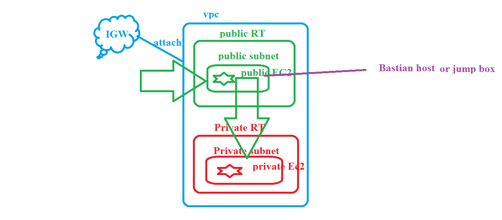
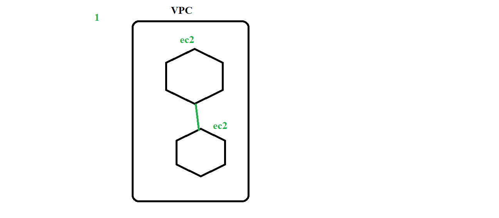
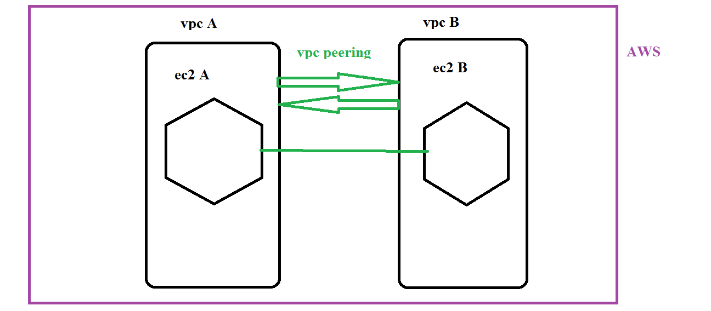
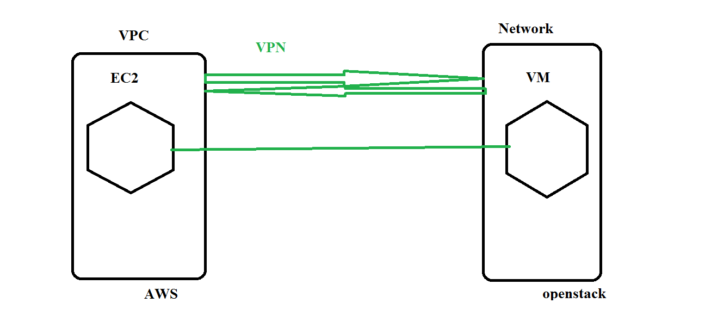

## login 
   1. i can able to login into public 
   2. i cant login into private ec2 machine(no internet) 
## how to login into private ec2 machine 
   
   1. first login into public ec2 machine and from there login into privare ec2 machine 
   2. here that public ec2 machine called bastian host or jump box 
  Note: if you want to login into ec2 machine we need key pair , so copy key pair(pem) into public ec2 machine  
    ```
    scp -i vpc-key.pem sorce destination(username@publicipaddress:/home/ubuntu)
    eg: 
    scp -i vpc-key.pem vpc-key.pem ubuntu@52.12.26.134:/home/ubuntu
    ``` 
## how can i enable internet access to private subnet machines 
   1. sol: NAT gate way
   2. create NAT gate in public subnet
   3. routed to private RT
   4. testing: now try install anything in private ec2 machine 
## ping or communicate  
   1.  i have 2 ec2 machines in vpc 
   2.  they are communicate with each other  beacuse both machines are present  same network(vpc)
   
   3.  i have one machine VPC A and one machine in VPC B 
       they want to communicate with each other directly not possible = VPC Peering  
    
   4. i have one machine in vpc (aws) and one machine in other netwok(openstack) they want to communicate with each other, directly not possible , we need to create VPN
    