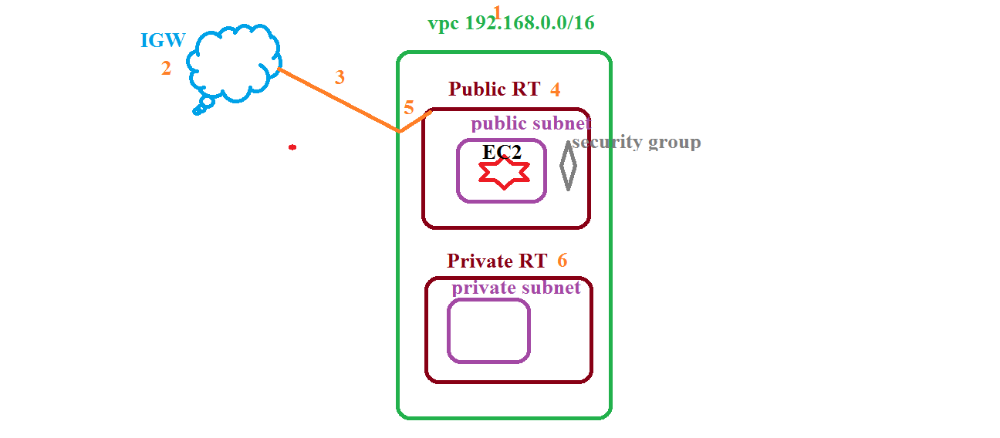

## VPC assignment 
   1. create vpc
   2. create IGW and attach vpc
   3. create Route table 
      1. Public Route table
      2. Private Route table 
   4. create subnets 
      1. public subnet
      2. private subnet 
   5. create security group (grant access to every one)
   6. launch EC2 machine in public and private subnet (skip)
   

