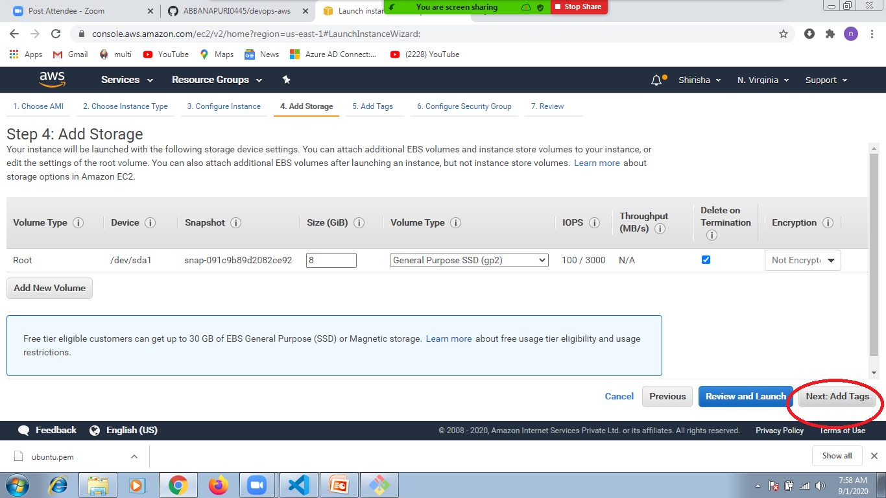
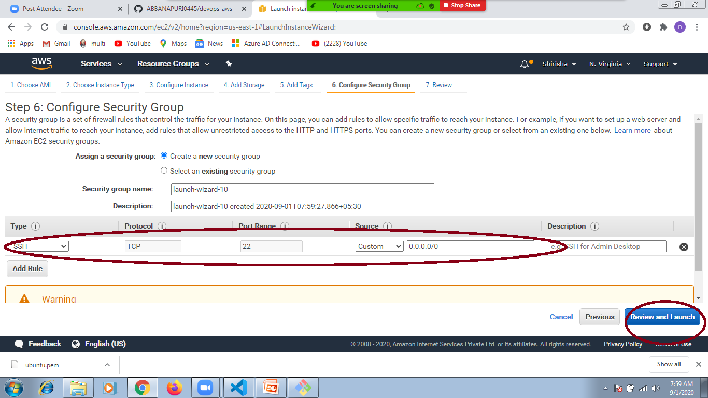
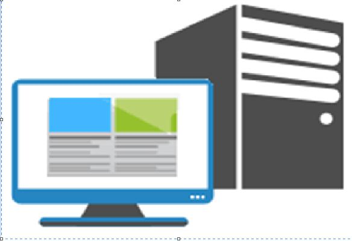
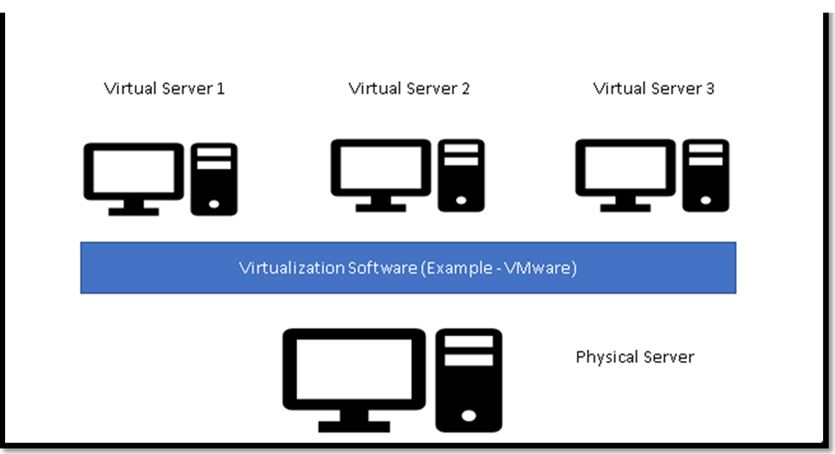

## activity:
   1. launch ubuntu and windows ec2 machine






   2. login into ec2 ubuntu and windows machine

## key note: 
   1. what is physical machine
    ```
        Personal computer 
        physical server is designated to a single user
        Each physical server includes memory, processor, network connection, hard drive, and an operating system (OS) for running programs
    ```
    

   2.  what is virtual machine
    ```
        multiple VMs run on the same physical hardware
    In this case, the computing resources of a physical server are virtualized and shared among all VMs running on it
    Vm’s create by using Virtualization softwares
    like hyper-v , vm ware etc
    ``` 

   1. what is ec2 
      * virtual machine as a service in aws
   2. how to launch ec2 machine
      * please follow above steps
   3. how to login into ec2 machine
      * please follow above steps

## terminate ec2 machines 
    