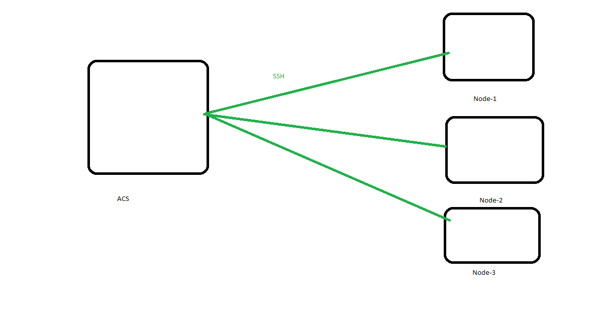

## CM 

* install jbos application server in ec2 machine 
    1. manual install (login into ec2 machine and install server)
         1. more time
         2. human error 
    2. automation using shell script 
         1. write shell script once use many times 
       disadv: 
         1. Idempotent: if you execute one time or many times it gives same result 
         2. shell script by default not maintain idempotent 
         3. install tomcat8 (if tomcat8 is already exists skip the script) 
         4. what to do , how to do , when to do 
    3. Configuration Management tools 
        1. idempotent 
        2. what to do --  
      * we deploy application
      * apply patches
      * create env  
## CM Models
    1. Pull(Agent based) 
        eg: Chef, Puppet  
    2. Push(Agent less)
        eg: Ansible , salt
    
--> edit file in 100 nodes 
    1. login into every server and edit file   2 days  * 10 hours , humon errors 
    2. create CM scripts once and apply from the workstation  10 min 

## Lab Setup 
   1. Master Setup(ACS): 
      1. install Ansible Control Server  (Linux/MAC/Solaries) 
         ```
         sudo apt update
         sudo apt install software-properties-common
         sudo apt-add-repository --yes --update ppa:ansible/ansible
         sudo apt install ansible
         ```
      2. create user  
         ```
         sudo -i 
         adduser ansible 
         ```  
      3. enable pwdbasedauthentication (open file using VI editor) save: Esc:wq  and restart sshd
         ```
         vi /etc/ssh/sshd_config
         systemctl restart sshd
         ```
      4. assign sudo previlage  
         ```
         visudo
         ```
      5. generate ssh keys 
         ```
         su ansible 
         ssh-keygen
         ```
      
    
## Node Setup 
   1. create user
      ```
      adduser ansible
      ```
   2. enable password auth
      ```
      vi /etc/ssh/sshd_config
      ```
   3. assign sudo 
      ```
      visudo
      ``` 
   4. restart sshd 
      ```
      systemctl restart sshd
      ```
## establish Connection from ACS to Node 
   1. login ACS 
   2. share ssh keys (su ansible)
       ```
       ssh-copy-id nodeusername@nodeIpaddress
       ssh-copy-id ansible@172.x.x.x
       ```
   3. add ip address in /etc/ansible/hosts
      ```
      vi /etc/ansible/hosts
      ```
   4. verify the connection 
      ```
      ansible -m ping all
      ```  
