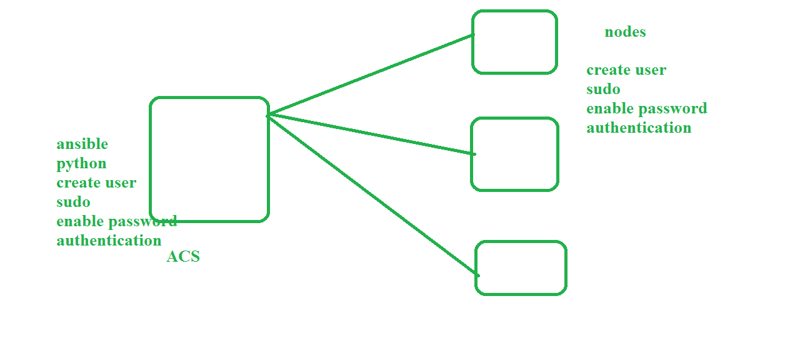

## Ansible Setup:

   1. ACS
      1. launch EC2 machine and login
      2. install ansible 
         ```
            sudo apt update
            sudo apt install software-properties-common
            sudo apt-add-repository --yes --update ppa:ansible/ansible
            sudo apt install ansible
         ```
      3. create user
         ```
         adduser ansible
         ```
      4. assign sudo permission (sudo user means he can do anything(install , remove, etc) except add user and assign privilege) 
         ```
         visudo
         ```
         for save file```nano -- ctrl+x and press y and enter ```
         
      5. enable password authentication (aws provide by default key based authentication here we need passwordauthentication)
         ```
         vi /etc/ssh/sshd_config
         ```
         for save file ```Esc:wq```
         
      6. restart sshd 
         ```
         systemctl restart sshd
         ```
   2. Nodes (3) 
      * No need to install ansible
      1. create user
      2. assign sudo permission
      3. enable password authentication
      4. retstart sshd 
## establish connection from ACS to Nodes
   1. login into ACS ```ssh usernameofACS@Ipaddress```
   2. generate keys ```ssh-keygen``` one-time-activity
   3. copy the key from ACS to each node ```ssh-copy-id nodeusername@nodeipaddress``` 
## Inventory
   1. it contains all node Ip address
   2. default inventory file ```/etc/ansible/hosts```
   3. add 3 node ip address in inventory file
   4. run command in ACS for Test connection ```ansible -m ping all``` 
[ACS](images/ACS.png) 