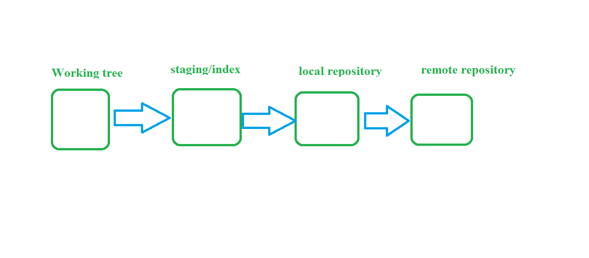
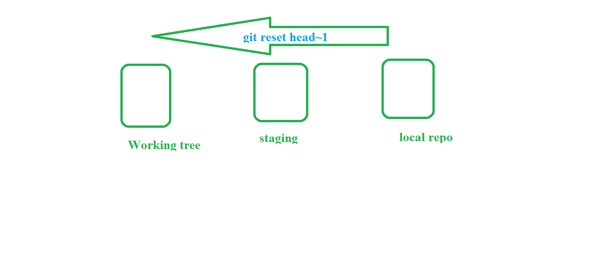

## git 
   1. install git 
      ```
      windows
      choco install git -y
      ubuntu
      apt-get update && apt-get install git -y
      ``` 
   2. create local repository 
      ```
      open gitbash
      git init  ## it will create .git folder
      ```
   3. areas of git 
      1. working: where we develop code 
      2. staging/index area
      3. local repository
      4. remote repository(github,bitbucket)
    
   4. How to push code from working tree to remote repository(github) 
      1. developer write code in working tree 
         ```
         eg: vi payment-method.md
              add payment feature
        ``` 
      2. moving staging area from working tree 
         ```
         git add .
         ``` 
      3. commit to local repository from staging (you will get commit id)
         ```
         git commit -m "add payment option"
         ``` 
      4. push to remote repository  from local repository
         1. very first time add global config 
            ```
            git config --global user.name "Naresh" 
            git config --global user.email "abbanapuri5354@gmail.com"
            ````
         2. add remote path to local repository
            ```
            create remote repository in github 
            add remote path to local repository
            eg
            git remote add origin https://github.com/user/repo.git
            ``` 
          3. push to github 
             ```
             git push 
             or
             git push -u origin master
             ```  
 ## undo chnages
   1. undo changes from staging to working tree 
       ```
       git reset        ## back into working tree
       git reset --hard ## delete from working tree
       ```
       
   2. undo changes from local repository to working tree 
      ```
      git reset head~1
      ``` 
      
 ## rewrite commit message 
   1. git commit --amend
   2. gi rabase commitid 
 ## branch 
   1. branch is line of development 
   2. let's take finacle example 
   3. same application release to 3 customers and they need to do some changes like UI and way of logins 
   4. in that case branch is helpfull 
   5. default branch is master
   6. create branch 
       ```
       git branch <branch-name> OR git checkout -b <branch-name>
       eg: git branch ICICI
       ```
   7. check out branch ```git checkout ICICI```
   8. display the branch's ```git branch```
   9. display the remote branch's ```git branch -r```
   10. push branch ```git push -u origin branchname```
        ```
        git push -u origin ICICI
        ``` 
   11. if i create branch from any branch all file  inhirate to new branch 

## Merge
   1.  integrate chnages from one branch to another branch 
   2.  we can do merge in 3 ways 
       1. merge [clickhere](https://www.atlassian.com/git/tutorials/using-branches/git-merge)
       2. rebase [clickhere](https://www.atlassian.com/git/tutorials/rewriting-history/git-rebase)
       3. cherry-pick[clickhere](https://www.atlassian.com/git/tutorials/cherry-pick)
   3. if you want to do merge 
      1. stay destination branch 
      2. run command ```git merge sourcebranch``` 
      3. Fastforward[click here](https://ariya.io/2013/09/fast-forward-git-merge) and conflict [clickhere](https://www.atlassian.com/git/tutorials/using-branches/merge-conflicts) 
## git 
   1. git init
   2. git pull = git fetch + git merge
   3. git push = push to remote repo(you need latest copy)
   4. git clone = download entire repo with .git
   5. git pull = download latest changes(you have already .git folder)
   6. git cheatsheet 
      [git](file:///E:/devops-aws/DevOps/CICD/Images/SWTM-2088_Atlassian-Git-Cheatsheet.pdf)
         