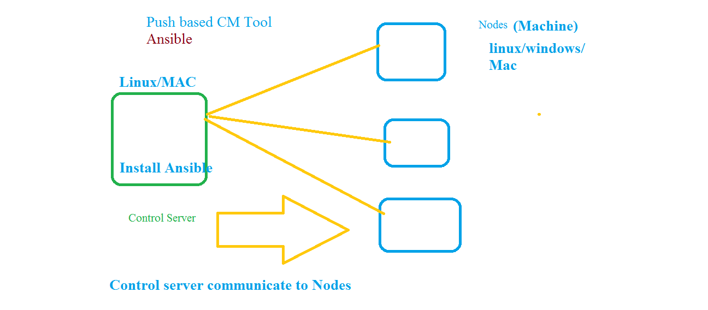
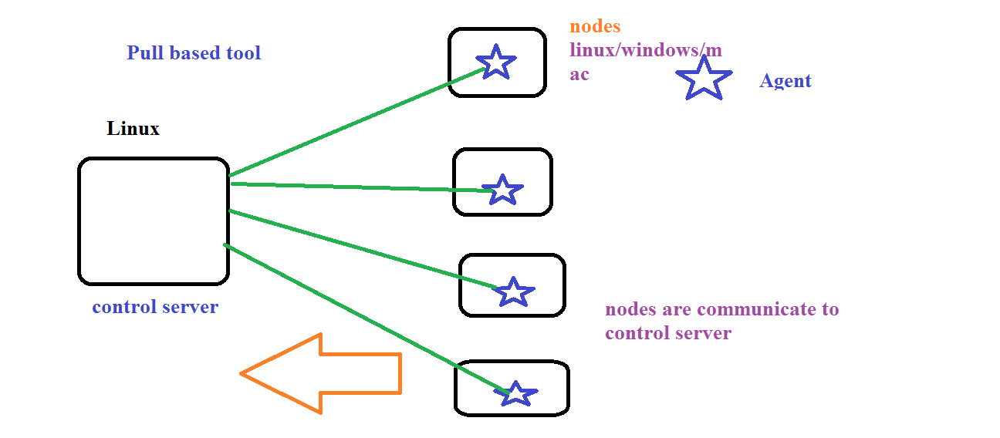

## Maintain machine:
   1. upgrade version  eg: java7 to java8 
   2. install software
   3. edit files
   4. apply patches
   5. etc 
## approches:
   1. Manual 
      1. it takes time
      2. human error
   2. shell or Powershell script
      1. its fast
      2. avoid human errors
      3. its not idempotent
   3. CM tools 
      1. CM tools are idempotent 
## Push based tool (asnible/salt)
   
## Pull Based tool (Chef/Puppet)
   

## Ansible Lab Setup
   1. controler server (linux/Mac)
      1. launch ec2 (ubuntu) machine
      2. login into machine
      3. install ansible server
           ````
            sudo apt update
            sudo apt install software-properties-common
            sudo apt-add-repository --yes --update ppa:ansible/ansible
            sudo apt install ansible
          ```
      4. create user 
         ```
          adduser username
          eg: adduser ansible 
         ```
      5. login into ansible
         ```
          su ansible
         ```
[click for ACS installation](https://docs.ansible.com/ansible/latest/installation_guide/intro_installation.html#installing-ansible-on-ubuntu)

   2. node(windows/linux/mac)


## Assignment
   1. launch ubuntu machine
   2. login into ubuntu machine 
   3. install ansible control server (ACS)
   4. create ansible user
      ```
      adduser username
      eg: adduser ansible 
      switch user (login into user)su
      su ansible
      ```