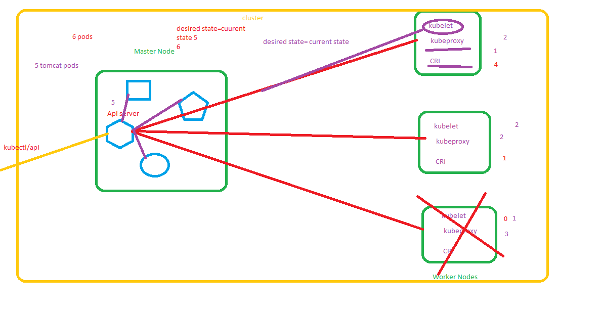

## Kubernetes: 
   1. Self healing 
   2. Auto Scaling 
   3. Load balancers 
   4. better storage Volumes
   5. k8s meant for Larger Workloads  

## Architecture 
   1. k8s cluster (combination of nodes(master and worker nodes) which is for same purpose) 
   2. Master Node: it manage all worker node
   3. Worker node: POD are deploy into Worker node assigned by master 
## Master Node Components 
   1. Kube Apiserver
   2. Scheduler
   3. Controll manager
   4. ETCD 
## Worker Node Components
   1. Kube Proxy
   2. Kubelet
   3. CRI (Container runtime Interface eg: Docker)

[click here](https://kubernetes.io/docs/concepts/overview/components/)
## Cluster
   1. Mini kube use case: for testing Manifest files
   2. kubeadm cluster (we need to maintain everything): use case: DEV, TEST, PreProd
   3. cloud provider:  Master Node maintain by Cloud Providers Use Case: Production
      * AWS --- EKS
      * Azure--- AKS
      * Google -- GKE
## workloads:
   1. Replication controller
   2. Replicaset
   3. deployment
   4. deamonset
   5. statefullset
   6. job and cron job
## network
   1. Service
   2. ingress
   3. DNS
   