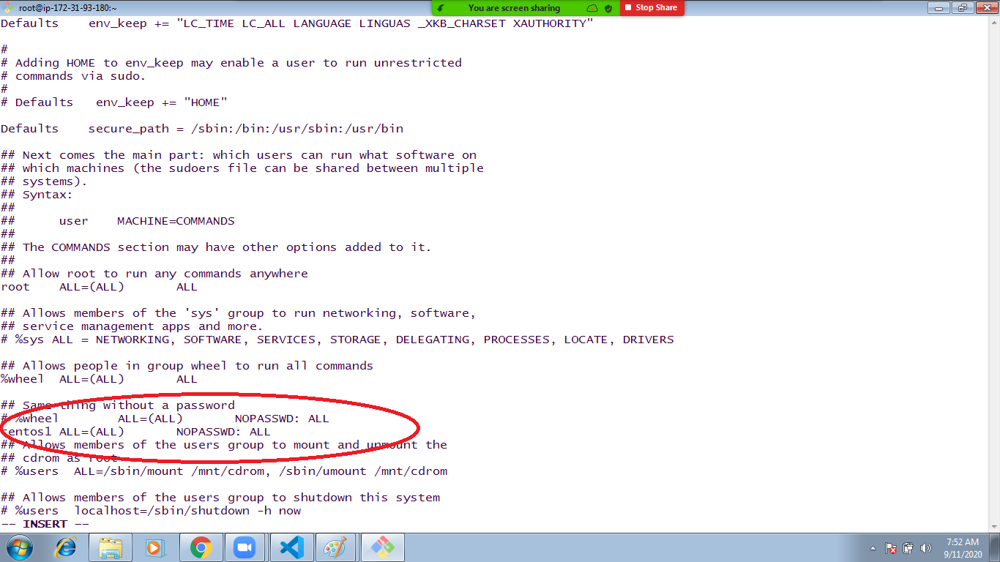

## setup Centos nodes 
   1. Launch centos machine 
   2. login into centos machine 
   3. login into root user ```sudo -i```
   4. create user 
      ```
      adduser centos1
      ```
   5. set password for centos user 
      ```
      passwd centos1
      ```
   6. assign sudo permission ```visudo```
      
   7. enable password authentication  ```vi /etc/ssh/sshd_config``` 
   8. restart sshd ```sudo systemctl restart sshd``` or ```sudo service sshd restart``` 
   9.  goto ansible control server ```ssh ansible@acsip``` 
   10. login into ansible ```su ansible```
   11. share keys into centos node ```ssh-copy-id centos@centosnodeprivateipaddress```
   12. ping all nodes ```ansible -m ping all```
   13. Inventory file
       