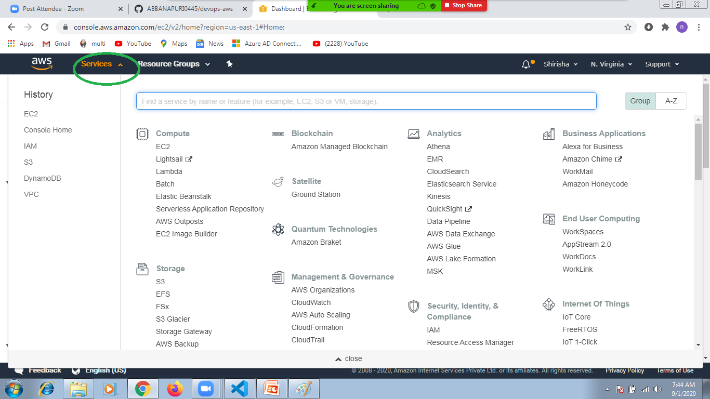
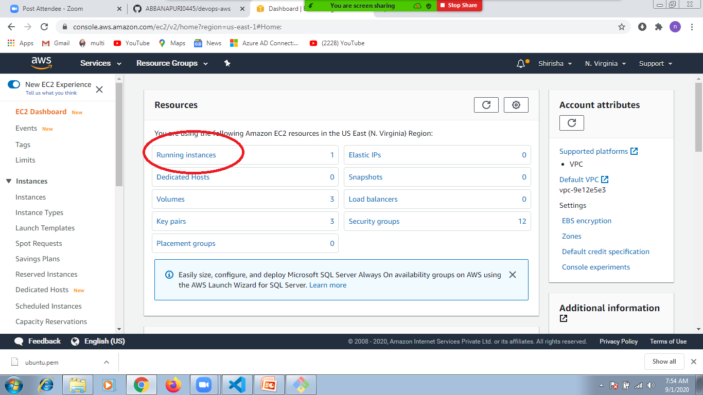
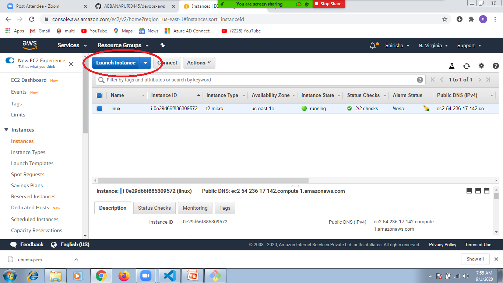
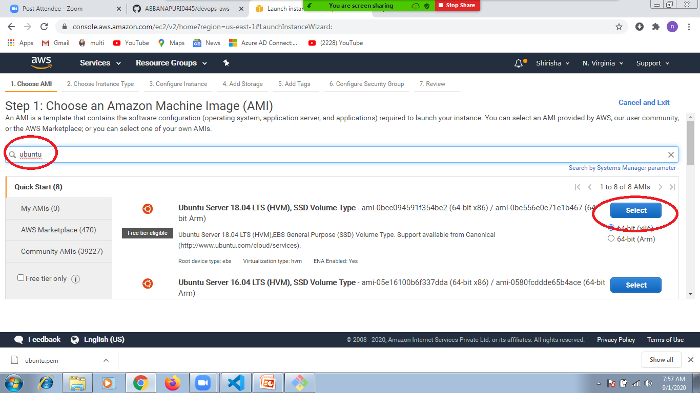
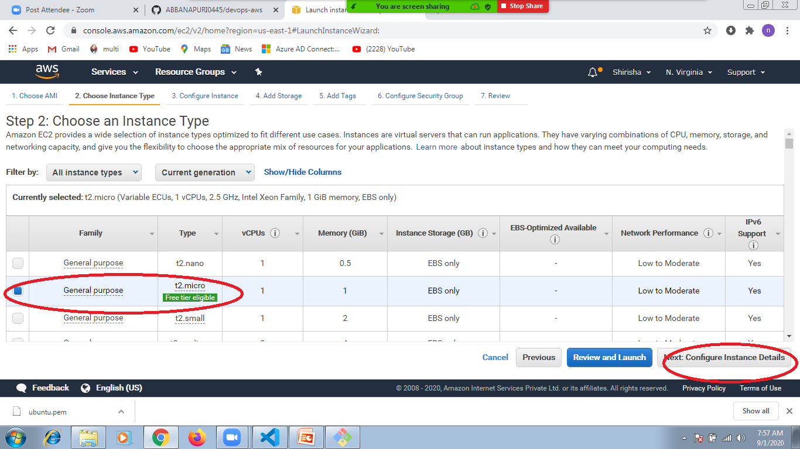
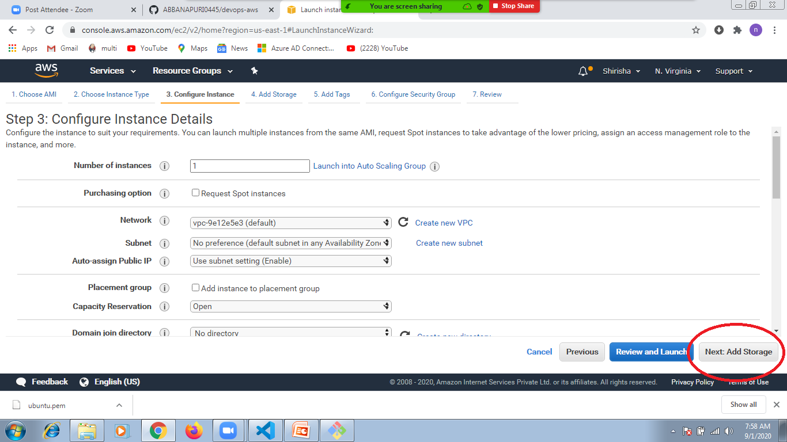
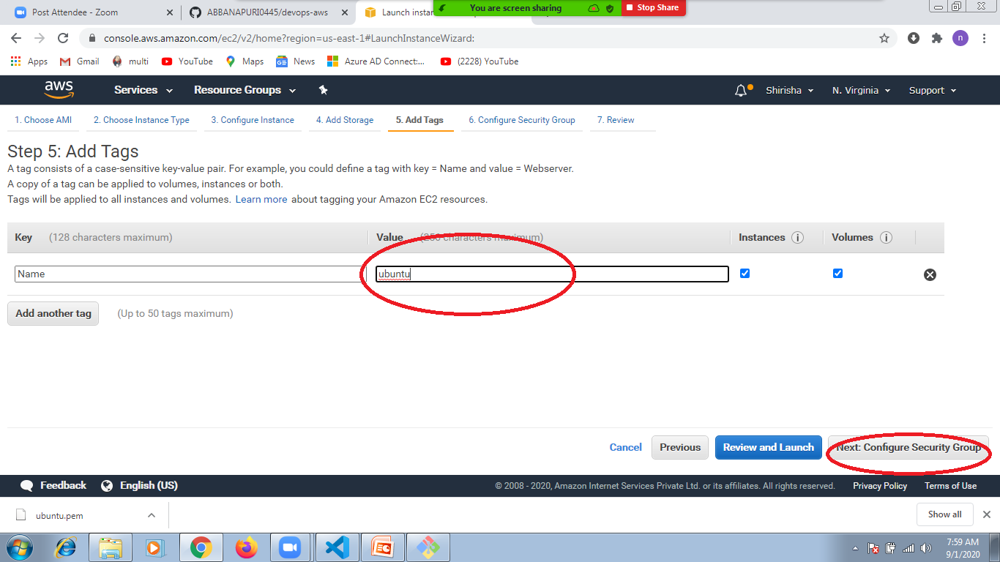
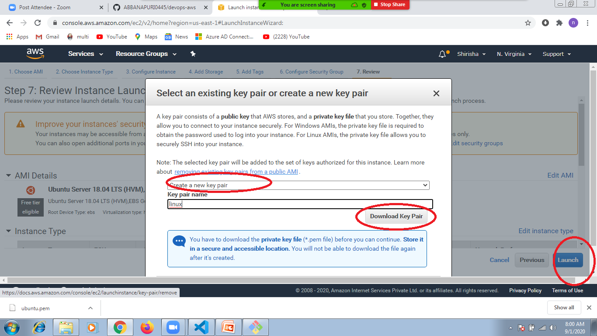

## activity:
   1. launch ubuntu and windows ec2 machine

   2. login into ec2 ubuntu and windows machine

## key note: 
    what physical machine
    what virtual machine
    what ec2 
    how to launch ec2 machine
    how to login into ec2 machine

## terminate ec2 machines 
    